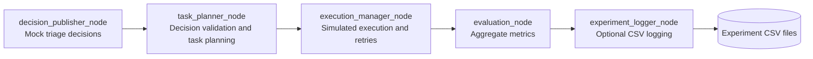
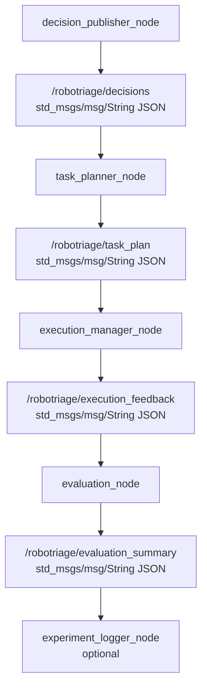
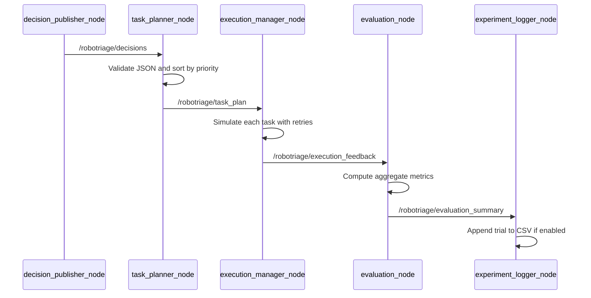
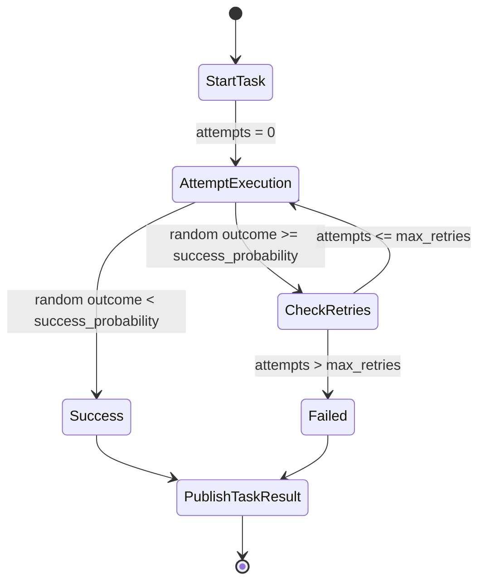

# RoboTriage Architecture

RoboTriage is implemented as a ROS2 Decision-to-Action Framework for battery triage simulation. The system connects a mock decision source to task planning, simulated robot-style execution, feedback, evaluation, and optional experiment logging.

The current implementation is deliberately perception-independent. It does not perform computer vision, physical battery disassembly, or advanced decision optimisation. The implemented contribution is the integration of decision outputs with downstream planning, execution, feedback, experiment logging, and evaluation.

## Component Architecture



Node responsibilities:

| Node | Responsibility |
| --- | --- |
| `decision_publisher_node` | Publishes a fixed mock decision batch with battery IDs, risk levels, target bins, and priorities. |
| `task_planner_node` | Validates the decision payload and creates priority-sorted `pick_and_place` tasks. |
| `execution_manager_node` | Simulates attempts for each task using `success_probability` and `max_retries`. |
| `evaluation_node` | Converts task-level execution feedback into aggregate metrics. |
| `experiment_logger_node` | Records evaluation summaries to a CSV file until `max_trials` is reached. |

## Topic Flow



The pipeline uses JSON encoded in `std_msgs/msg/String` messages. This makes the MVP simple to inspect with `ros2 topic echo` and avoids adding custom message definitions before the node boundaries are stable.

## Message Content

The mock decision publisher sends one batch with `plan_id` and a `batteries` list. Each battery includes:

- `id`
- `risk_level`
- `target_bin`
- `priority`

The task planner sorts batteries by `priority` and emits a task plan containing:

- `plan_id`
- `tasks`
- task fields including `task_id`, `object_id`, `action`, `source_location`, `target_bin`, `priority`, and `status`

The execution manager emits one result per task, including:

- `task_id`
- `object_id`
- `action`
- `target_bin`
- `final_status`
- `attempts`
- `retry_count`
- `success_probability`
- `max_retries`
- `simulated_duration_seconds`

The evaluation node publishes aggregate metrics:

- `total_tasks`
- `successful_tasks`
- `failed_tasks`
- `success_rate_percent`
- `total_retries`
- `average_retries_per_task`
- `average_duration_seconds`
- `longest_task_duration_seconds`

The experiment logger writes CSV rows with trial-level metrics:

- `trial_id`
- `plan_id`
- `total_tasks`
- `succeeded`
- `failed`
- `success_rate`
- `average_attempts`
- `average_duration_seconds`
- `timestamp`

## Single-Trial Sequence



`experiment_logger_node` is launched only when `enable_experiment_logger:=true`.

## Retry State Machine



The execution manager declares these parameters:

| Parameter | Default | Description |
| --- | ---: | --- |
| `success_probability` | `0.85` | Probability that each execution attempt succeeds. |
| `max_retries` | `2` | Maximum number of retries after the first failed attempt. |

The implementation loops while `attempts <= max_retries` and the task has not succeeded. Therefore, a task may be attempted up to `max_retries + 1` times.

## Launch Configuration

The full pipeline is launched with:

```bash
ros2 launch robotriage_core robotriage_pipeline.launch.py
```

Supported launch arguments:

| Argument | Default |
| --- | ---: |
| `success_probability` | `0.85` |
| `max_retries` | `2` |
| `enable_experiment_logger` | `false` |
| `experiment_output_csv` | `experiment_results.csv` |
| `max_trials` | `10` |

Example:

```bash
ros2 launch robotriage_core robotriage_pipeline.launch.py \
  enable_experiment_logger:=true \
  experiment_output_csv:=results_30_final/p0_7_r2.csv \
  max_trials:=30 \
  success_probability:=0.7 \
  max_retries:=2
```

## Experiment Automation

The grid runner is:

```text
src/robotriage_core/scripts/run_experiment_grid.py
```

It supports:

- configurable `success_probability` values
- configurable `max_retries` values
- configurable `max_trials`
- configurable `output_dir`
- `--summarise-only`
- `ROS_DOMAIN_ID` isolation with `--domain-start`
- process group cleanup for launched ROS2 child processes

Final experiment command:

```bash
python3 src/robotriage_core/scripts/run_experiment_grid.py \
  --success-probabilities 0.1 0.3 0.5 0.7 0.9 \
  --max-retries-values 0 1 2 4 \
  --max-trials 30 \
  --output-dir results_30_final
```

Summary-only command:

```bash
python3 src/robotriage_core/scripts/run_experiment_grid.py \
  --success-probabilities 0.1 0.3 0.5 0.7 0.9 \
  --max-retries-values 0 1 2 4 \
  --max-trials 30 \
  --output-dir results_30_final \
  --summarise-only
```

## Final 600-Trial Experiment

The final clean experiment is stored in:

```text
results_30_final/
```

It contains:

| Item | Value |
| --- | ---: |
| Success probability values | `0.1`, `0.3`, `0.5`, `0.7`, `0.9` |
| Retry values | `0`, `1`, `2`, `4` |
| Parameter combinations | `20` |
| Trials per combination | `30` |
| Total trials | `600` |
| Summary CSV | `results_30_final/experiment_grid_summary.csv` |

All rows in `results_30_final/experiment_grid_summary.csv` have status `completed`.

The final generated plots are:

```text
results_30_final/plots/success_probability_vs_success_rate.png
results_30_final/plots/retries_vs_success_rate.png
results_30_final/plots/retries_vs_average_attempts.png
results_30_final/plots/retries_vs_average_duration.png
```

These plots show the measured effect of configured execution reliability and retries on aggregate success rate, average attempts, and simulated duration. Higher configured success probability generally increases measured success rate, while allowing more retries improves success rate at the cost of more attempts and, in many cases, longer simulated duration.

The plot script currently defaults to `results_30`. To regenerate plots for `results_30_final` without changing the source file:

```bash
python3 -c "from pathlib import Path; import sys; sys.path.insert(0, 'src/robotriage_core/scripts'); import plot_experiment_results as p; p.INPUT_CSV = Path('results_30_final/experiment_grid_summary.csv'); p.OUTPUT_DIR = Path('results_30_final/plots'); p.main()"
```

## Current Boundaries

RoboTriage currently demonstrates a simulated decision-to-action loop. The following are outside the current implementation:

- computer vision or perception pipelines
- real battery disassembly
- physical robot control
- motion planning
- complex decision algorithms
- custom ROS2 message interfaces

Those boundaries are intentional for the current package freeze. The implemented system focuses on ROS2 integration, task-flow structure, retry behaviour, experiment logging, and evaluation.
